# The Failure Map (generated)

This file is generated from the shipped content JSON: `packages/content/data/failureModes.json`, `symptoms.json`, and `diagnosticTests.json`. It can never drift from the game because it is not hand-edited - regenerate it after any change to those files:

```
node scripts/generateFailureMap.cjs
```

The design intent (ontology, laws, review notes) lives in `failure-map.md`; this file is the proof the shipped content matches it.

## Registry

55 failure modes, referenced across 17 symptoms.

| id | part | band | referenced by (weight) |
|---|---|---|---|
| valve-seals | headValvetrain | worn | smokes-on-startup (45) |
| gunked-breather | intake | worn | smokes-on-startup (20) |
| head-gasket | headValvetrain | poor | smokes-on-startup (22) |
| tired-rings | internals | scrap | smokes-on-startup (13) |
| flat-battery | ignitionEcu | worn | non-starter (57) |
| fuel-pump | fuelSystem | poor | non-starter (31) |
| seized-engine | block | scrap | non-starter (12) |
| lifter-tick | headValvetrain | poor | tick-at-idle (62) |
| blowing-manifold | exhaust | poor | tick-at-idle (25) |
| rod-knock | internals | scrap | tick-at-idle (13) |
| vacuum-leak | intake | worn | wont-idle (48) |
| tired-ecu | ignitionEcu | poor | wont-idle (27) |
| worn-cams | camsTiming | poor | wont-idle (15) |
| burnt-valve | headValvetrain | scrap | wont-idle (10) |
| worn-synchros | gearbox | worn | crunch-into-second (48) |
| low-thin-oil | gearbox | fine | crunch-into-second (14) |
| dragging-clutch | clutch | poor | crunch-into-second (20) |
| chewed-gearset | gearbox | scrap | crunch-into-second (18) |
| tired-bushes | antiRollBars | worn | clunk-over-bumps (42) |
| blown-dampers | dampers | poor | clunk-over-bumps (33) |
| steering-play | steering | poor | clunk-over-bumps (15) |
| rotted-subframe-mount | underbody | scrap | clunk-over-bumps (10) |
| glazed-pads | brakePadsDiscs | worn | pulls-under-braking (55) |
| seized-calliper | brakeCalipersLines | poor | pulls-under-braking (45) |
| fan-switch | ignitionEcu | worn | overheats-in-traffic (38) |
| tired-radiator | cooling | poor | overheats-in-traffic (35) |
| early-head-gasket | headValvetrain | poor | overheats-in-traffic (17) |
| cracked-block | block | scrap | overheats-in-traffic (10) |
| worn-tyres | tyres | worn | wheel-vibration (55) |
| buckled-rim | rims | poor | wheel-vibration (30) |
| worn-driveshaft | driveline | poor | wheel-vibration (15) |
| worn-diff-bearings | differential | worn | diff-whine (60) |
| worn-propshaft-uj | driveline | poor | diff-whine (22) |
| chewed-ring-pinion | differential | scrap | diff-whine (18) |
| sagging-springs | springs | worn | sagging-spring (62) |
| broken-spring | springs | poor | sagging-spring (25) |
| rotted-strut-turret | chassis | scrap | sagging-spring (13) |
| panel-respray | panels | worn | quarter-panel-filler (60) |
| rust-patch | panels | poor | quarter-panel-filler (25) |
| structural-rail-repair | chassis | scrap | quarter-panel-filler (15) |
| heater-matrix-weep | cooling | worn | damp-passenger-footwell (38) |
| blocked-scuttle-drain | underbody | worn | damp-passenger-footwell (20) |
| perished-grommet | chassis | poor | damp-passenger-footwell (14) |
| split-sunroof-drain | dashGauges | poor | damp-passenger-footwell (10) |
| rotten-bulkhead-seam | chassis | scrap | damp-passenger-footwell (18) |
| blown-flex-joint | exhaust | worn | exhaust-rasp (60) |
| cracked-manifold | exhaust | poor | exhaust-rasp (40) |
| tired-sender | dashGauges | worn | oil-pressure-flutter (65) |
| worn-oil-pump | internals | poor | oil-pressure-flutter (20) |
| worn-main-bearings | internals | scrap | oil-pressure-flutter (15) |
| clogged-fuel-filter | fuelSystem | worn | hesitates-under-load (62) |
| stretched-timing-chain | camsTiming | poor | hesitates-under-load (26) |
| jumped-timing-chain | headValvetrain | scrap | hesitates-under-load (12) |
| tired-track-rod-ends | steering | worn | steering-wander (60) |
| worn-rack | steering | poor | steering-wander (40) |

## Symptoms

### smokes-on-startup

Smokes on startup.

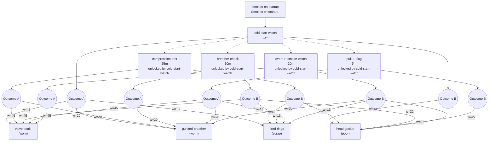
```mermaid
flowchart TD
  SYM_smokes_on_startup["smokes-on-startup<br/>Smokes on startup."]
  T_cold_start_watch["cold-start-watch<br/>10m"]
  SYM_smokes_on_startup --> T_cold_start_watch
  T_cold_start_watch --> T_cold_start_watch_G0(("Outcome A"))
  FM_valve_seals["valve-seals<br/>(worn)"]
  T_cold_start_watch_G0 -->|"w=45"| FM_valve_seals
  FM_gunked_breather["gunked-breather<br/>(worn)"]
  T_cold_start_watch_G0 -->|"w=20"| FM_gunked_breather
  FM_tired_rings["tired-rings<br/>(scrap)"]
  T_cold_start_watch_G0 -->|"w=13"| FM_tired_rings
  T_cold_start_watch --> T_cold_start_watch_G1(("Outcome B"))
  FM_head_gasket["head-gasket<br/>(poor)"]
  T_cold_start_watch_G1 -->|"w=22"| FM_head_gasket
  T_compression_test["compression-test<br/>25m<br/>unlocked by cold-start-watch"]
  T_cold_start_watch -.-> T_compression_test
  T_compression_test --> T_compression_test_G0(("Outcome A"))
  T_compression_test_G0 -->|"w=45"| FM_valve_seals
  T_compression_test_G0 -->|"w=20"| FM_gunked_breather
  T_compression_test --> T_compression_test_G1(("Outcome B"))
  T_compression_test_G1 -->|"w=13"| FM_tired_rings
  T_compression_test_G1 -->|"w=22"| FM_head_gasket
  T_breather_check["breather-check<br/>10m<br/>unlocked by cold-start-watch"]
  T_cold_start_watch -.-> T_breather_check
  T_breather_check --> T_breather_check_G0(("Outcome A"))
  T_breather_check_G0 -->|"w=20"| FM_gunked_breather
  T_breather_check --> T_breather_check_G1(("Outcome B"))
  T_breather_check_G1 -->|"w=45"| FM_valve_seals
  T_breather_check_G1 -->|"w=22"| FM_head_gasket
  T_breather_check_G1 -->|"w=13"| FM_tired_rings
  T_pull_a_plug["pull-a-plug<br/>5m<br/>unlocked by cold-start-watch"]
  T_cold_start_watch -.-> T_pull_a_plug
  T_pull_a_plug --> T_pull_a_plug_G0(("Outcome A"))
  T_pull_a_plug_G0 -->|"w=45"| FM_valve_seals
  T_pull_a_plug_G0 -->|"w=20"| FM_gunked_breather
  T_pull_a_plug_G0 -->|"w=13"| FM_tired_rings
  T_pull_a_plug --> T_pull_a_plug_G1(("Outcome B"))
  T_pull_a_plug_G1 -->|"w=22"| FM_head_gasket
  T_overrun_smoke_watch["overrun-smoke-watch<br/>10m<br/>unlocked by cold-start-watch"]
  T_cold_start_watch -.-> T_overrun_smoke_watch
  T_overrun_smoke_watch --> T_overrun_smoke_watch_G0(("Outcome A"))
  T_overrun_smoke_watch_G0 -->|"w=45"| FM_valve_seals
  T_overrun_smoke_watch --> T_overrun_smoke_watch_G1(("Outcome B"))
  T_overrun_smoke_watch_G1 -->|"w=20"| FM_gunked_breather
  T_overrun_smoke_watch_G1 -->|"w=13"| FM_tired_rings
  T_overrun_smoke_watch_G1 -->|"w=22"| FM_head_gasket
```

### non-starter

Won't start. Turns over, nothing catches.

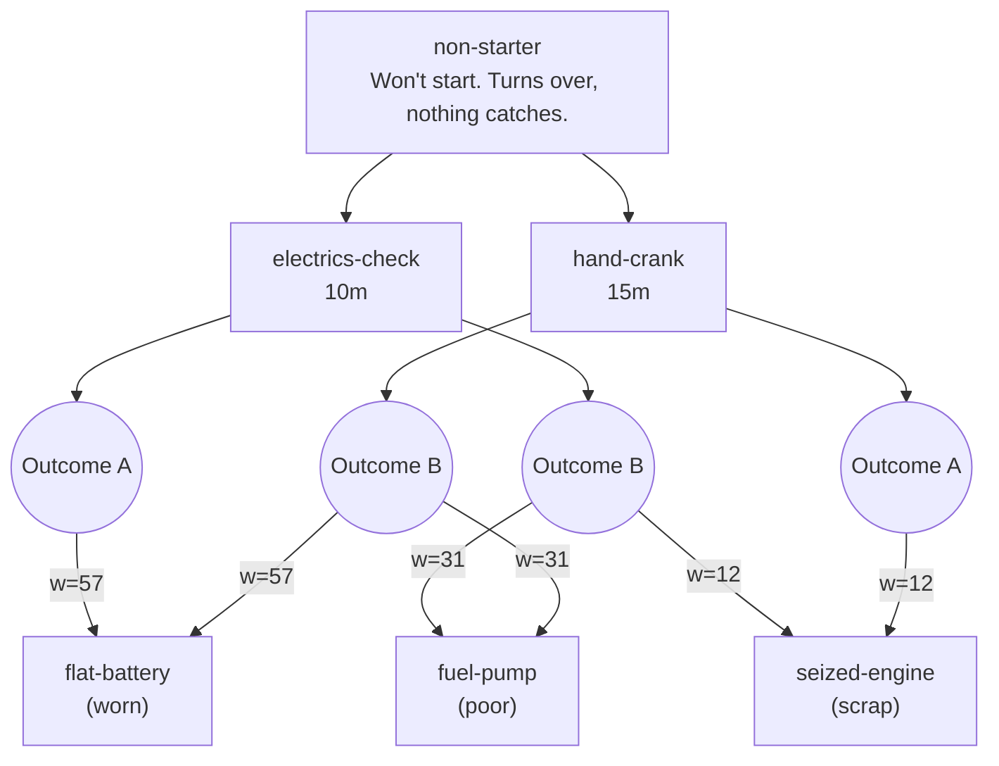
```mermaid
flowchart TD
  SYM_non_starter["non-starter<br/>Won't start. Turns over, nothing catches."]
  T_electrics_check["electrics-check<br/>10m"]
  SYM_non_starter --> T_electrics_check
  T_electrics_check --> T_electrics_check_G0(("Outcome A"))
  FM_flat_battery["flat-battery<br/>(worn)"]
  T_electrics_check_G0 -->|"w=57"| FM_flat_battery
  T_electrics_check --> T_electrics_check_G1(("Outcome B"))
  FM_fuel_pump["fuel-pump<br/>(poor)"]
  T_electrics_check_G1 -->|"w=31"| FM_fuel_pump
  FM_seized_engine["seized-engine<br/>(scrap)"]
  T_electrics_check_G1 -->|"w=12"| FM_seized_engine
  T_hand_crank["hand-crank<br/>15m"]
  SYM_non_starter --> T_hand_crank
  T_hand_crank --> T_hand_crank_G0(("Outcome A"))
  T_hand_crank_G0 -->|"w=12"| FM_seized_engine
  T_hand_crank --> T_hand_crank_G1(("Outcome B"))
  T_hand_crank_G1 -->|"w=57"| FM_flat_battery
  T_hand_crank_G1 -->|"w=31"| FM_fuel_pump
```

### tick-at-idle

Faint tick at idle. Probably nothing.

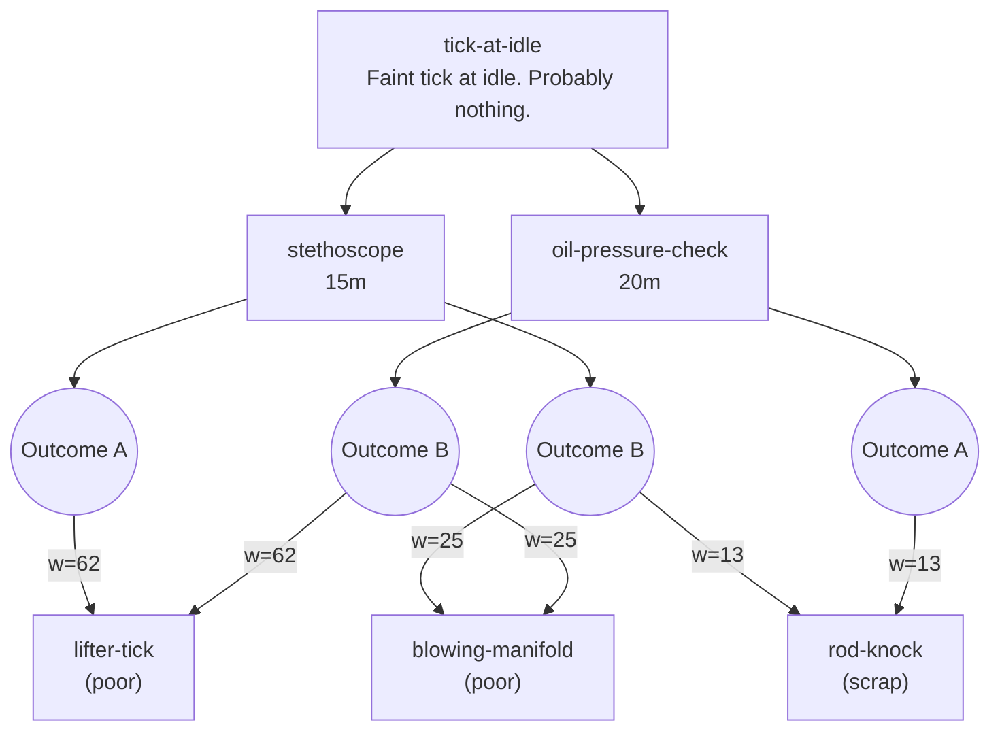
```mermaid
flowchart TD
  SYM_tick_at_idle["tick-at-idle<br/>Faint tick at idle. Probably nothing."]
  T_stethoscope["stethoscope<br/>15m"]
  SYM_tick_at_idle --> T_stethoscope
  T_stethoscope --> T_stethoscope_G0(("Outcome A"))
  FM_lifter_tick["lifter-tick<br/>(poor)"]
  T_stethoscope_G0 -->|"w=62"| FM_lifter_tick
  T_stethoscope --> T_stethoscope_G1(("Outcome B"))
  FM_blowing_manifold["blowing-manifold<br/>(poor)"]
  T_stethoscope_G1 -->|"w=25"| FM_blowing_manifold
  FM_rod_knock["rod-knock<br/>(scrap)"]
  T_stethoscope_G1 -->|"w=13"| FM_rod_knock
  T_oil_pressure_check["oil-pressure-check<br/>20m"]
  SYM_tick_at_idle --> T_oil_pressure_check
  T_oil_pressure_check --> T_oil_pressure_check_G0(("Outcome A"))
  T_oil_pressure_check_G0 -->|"w=13"| FM_rod_knock
  T_oil_pressure_check --> T_oil_pressure_check_G1(("Outcome B"))
  T_oil_pressure_check_G1 -->|"w=62"| FM_lifter_tick
  T_oil_pressure_check_G1 -->|"w=25"| FM_blowing_manifold
```

### wont-idle

Won't hold an idle. Hunts and dies.

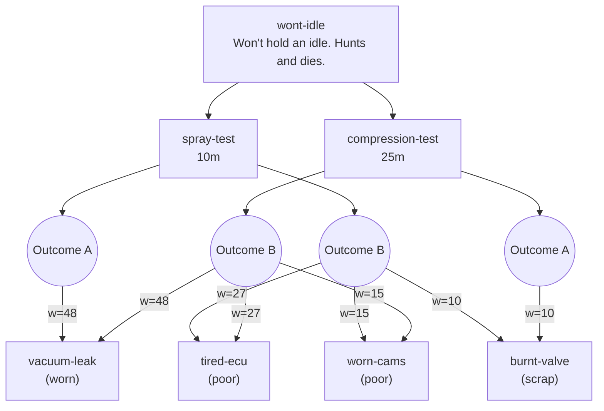
```mermaid
flowchart TD
  SYM_wont_idle["wont-idle<br/>Won't hold an idle. Hunts and dies."]
  T_spray_test["spray-test<br/>10m"]
  SYM_wont_idle --> T_spray_test
  T_spray_test --> T_spray_test_G0(("Outcome A"))
  FM_vacuum_leak["vacuum-leak<br/>(worn)"]
  T_spray_test_G0 -->|"w=48"| FM_vacuum_leak
  T_spray_test --> T_spray_test_G1(("Outcome B"))
  FM_tired_ecu["tired-ecu<br/>(poor)"]
  T_spray_test_G1 -->|"w=27"| FM_tired_ecu
  FM_worn_cams["worn-cams<br/>(poor)"]
  T_spray_test_G1 -->|"w=15"| FM_worn_cams
  FM_burnt_valve["burnt-valve<br/>(scrap)"]
  T_spray_test_G1 -->|"w=10"| FM_burnt_valve
  T_compression_test["compression-test<br/>25m"]
  SYM_wont_idle --> T_compression_test
  T_compression_test --> T_compression_test_G0(("Outcome A"))
  T_compression_test_G0 -->|"w=10"| FM_burnt_valve
  T_compression_test --> T_compression_test_G1(("Outcome B"))
  T_compression_test_G1 -->|"w=48"| FM_vacuum_leak
  T_compression_test_G1 -->|"w=27"| FM_tired_ecu
  T_compression_test_G1 -->|"w=15"| FM_worn_cams
```

### crunch-into-second

Crunches into second when cold.

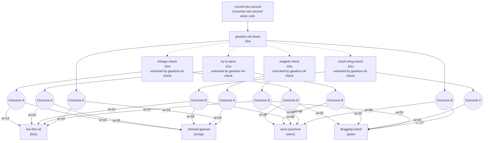
```mermaid
flowchart TD
  SYM_crunch_into_second["crunch-into-second<br/>Crunches into second when cold."]
  T_gearbox_oil_check["gearbox-oil-check<br/>15m"]
  SYM_crunch_into_second --> T_gearbox_oil_check
  T_gearbox_oil_check --> T_gearbox_oil_check_G0(("Outcome A"))
  FM_low_thin_oil["low-thin-oil<br/>(fine)"]
  T_gearbox_oil_check_G0 -->|"w=14"| FM_low_thin_oil
  FM_chewed_gearset["chewed-gearset<br/>(scrap)"]
  T_gearbox_oil_check_G0 -->|"w=18"| FM_chewed_gearset
  T_gearbox_oil_check --> T_gearbox_oil_check_G1(("Outcome B"))
  FM_worn_synchros["worn-synchros<br/>(worn)"]
  T_gearbox_oil_check_G1 -->|"w=48"| FM_worn_synchros
  FM_dragging_clutch["dragging-clutch<br/>(poor)"]
  T_gearbox_oil_check_G1 -->|"w=20"| FM_dragging_clutch
  T_magnet_check["magnet-check<br/>10m<br/>unlocked by gearbox-oil-check"]
  T_gearbox_oil_check -.-> T_magnet_check
  T_magnet_check --> T_magnet_check_G0(("Outcome A"))
  T_magnet_check_G0 -->|"w=18"| FM_chewed_gearset
  T_magnet_check --> T_magnet_check_G1(("Outcome B"))
  T_magnet_check_G1 -->|"w=48"| FM_worn_synchros
  T_magnet_check_G1 -->|"w=14"| FM_low_thin_oil
  T_magnet_check_G1 -->|"w=20"| FM_dragging_clutch
  T_clutch_drag_check["clutch-drag-check<br/>10m<br/>unlocked by gearbox-oil-check"]
  T_gearbox_oil_check -.-> T_clutch_drag_check
  T_clutch_drag_check --> T_clutch_drag_check_G0(("Outcome A"))
  T_clutch_drag_check_G0 -->|"w=20"| FM_dragging_clutch
  T_clutch_drag_check --> T_clutch_drag_check_G1(("Outcome B"))
  T_clutch_drag_check_G1 -->|"w=48"| FM_worn_synchros
  T_clutch_drag_check_G1 -->|"w=14"| FM_low_thin_oil
  T_clutch_drag_check_G1 -->|"w=18"| FM_chewed_gearset
  T_try_it_warm["try-it-warm<br/>15m<br/>unlocked by gearbox-oil-check"]
  T_gearbox_oil_check -.-> T_try_it_warm
  T_try_it_warm --> T_try_it_warm_G0(("Outcome A"))
  T_try_it_warm_G0 -->|"w=14"| FM_low_thin_oil
  T_try_it_warm_G0 -->|"w=18"| FM_chewed_gearset
  T_try_it_warm --> T_try_it_warm_G1(("Outcome B"))
  T_try_it_warm_G1 -->|"w=48"| FM_worn_synchros
  T_try_it_warm_G1 -->|"w=20"| FM_dragging_clutch
  T_linkage_check["linkage-check<br/>10m<br/>unlocked by gearbox-oil-check"]
  T_gearbox_oil_check -.-> T_linkage_check
  T_linkage_check --> T_linkage_check_G0(("Outcome A"))
  T_linkage_check_G0 -->|"w=14"| FM_low_thin_oil
  T_linkage_check_G0 -->|"w=18"| FM_chewed_gearset
  T_linkage_check --> T_linkage_check_G1(("Outcome B"))
  T_linkage_check_G1 -->|"w=48"| FM_worn_synchros
  T_linkage_check_G1 -->|"w=20"| FM_dragging_clutch
```

### clunk-over-bumps

Clunks over bumps at the back.

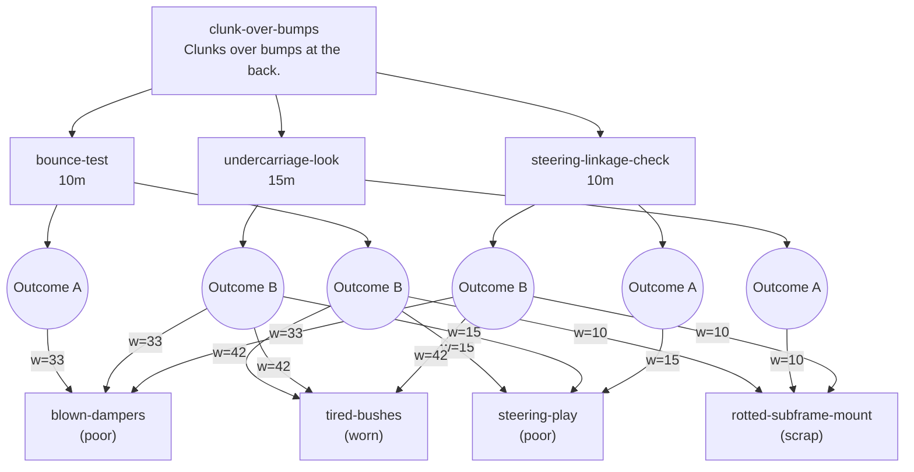
```mermaid
flowchart TD
  SYM_clunk_over_bumps["clunk-over-bumps<br/>Clunks over bumps at the back."]
  T_bounce_test["bounce-test<br/>10m"]
  SYM_clunk_over_bumps --> T_bounce_test
  T_bounce_test --> T_bounce_test_G0(("Outcome A"))
  FM_blown_dampers["blown-dampers<br/>(poor)"]
  T_bounce_test_G0 -->|"w=33"| FM_blown_dampers
  T_bounce_test --> T_bounce_test_G1(("Outcome B"))
  FM_tired_bushes["tired-bushes<br/>(worn)"]
  T_bounce_test_G1 -->|"w=42"| FM_tired_bushes
  FM_steering_play["steering-play<br/>(poor)"]
  T_bounce_test_G1 -->|"w=15"| FM_steering_play
  FM_rotted_subframe_mount["rotted-subframe-mount<br/>(scrap)"]
  T_bounce_test_G1 -->|"w=10"| FM_rotted_subframe_mount
  T_undercarriage_look["undercarriage-look<br/>15m"]
  SYM_clunk_over_bumps --> T_undercarriage_look
  T_undercarriage_look --> T_undercarriage_look_G0(("Outcome A"))
  T_undercarriage_look_G0 -->|"w=10"| FM_rotted_subframe_mount
  T_undercarriage_look --> T_undercarriage_look_G1(("Outcome B"))
  T_undercarriage_look_G1 -->|"w=42"| FM_tired_bushes
  T_undercarriage_look_G1 -->|"w=33"| FM_blown_dampers
  T_undercarriage_look_G1 -->|"w=15"| FM_steering_play
  T_steering_linkage_check["steering-linkage-check<br/>10m"]
  SYM_clunk_over_bumps --> T_steering_linkage_check
  T_steering_linkage_check --> T_steering_linkage_check_G0(("Outcome A"))
  T_steering_linkage_check_G0 -->|"w=15"| FM_steering_play
  T_steering_linkage_check --> T_steering_linkage_check_G1(("Outcome B"))
  T_steering_linkage_check_G1 -->|"w=42"| FM_tired_bushes
  T_steering_linkage_check_G1 -->|"w=33"| FM_blown_dampers
  T_steering_linkage_check_G1 -->|"w=10"| FM_rotted_subframe_mount
```

### pulls-under-braking

Pulls left under braking.

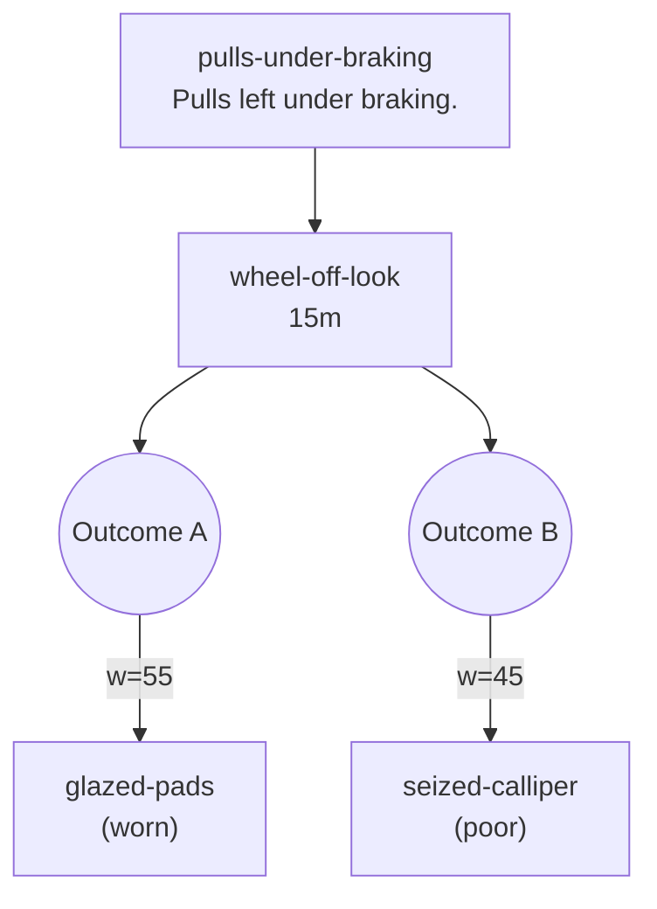
```mermaid
flowchart TD
  SYM_pulls_under_braking["pulls-under-braking<br/>Pulls left under braking."]
  T_wheel_off_look["wheel-off-look<br/>15m"]
  SYM_pulls_under_braking --> T_wheel_off_look
  T_wheel_off_look --> T_wheel_off_look_G0(("Outcome A"))
  FM_glazed_pads["glazed-pads<br/>(worn)"]
  T_wheel_off_look_G0 -->|"w=55"| FM_glazed_pads
  T_wheel_off_look --> T_wheel_off_look_G1(("Outcome B"))
  FM_seized_calliper["seized-calliper<br/>(poor)"]
  T_wheel_off_look_G1 -->|"w=45"| FM_seized_calliper
```

### overheats-in-traffic

Runs hot in traffic. Fine on the move.

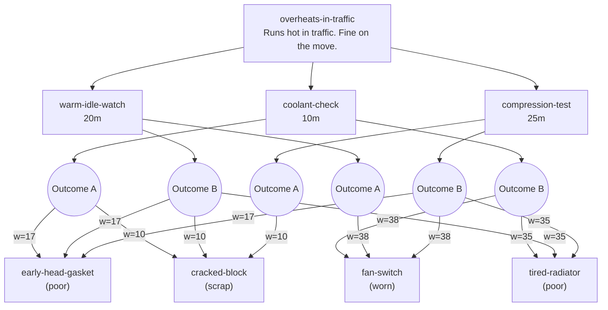
```mermaid
flowchart TD
  SYM_overheats_in_traffic["overheats-in-traffic<br/>Runs hot in traffic. Fine on the move."]
  T_coolant_check["coolant-check<br/>10m"]
  SYM_overheats_in_traffic --> T_coolant_check
  T_coolant_check --> T_coolant_check_G0(("Outcome A"))
  FM_early_head_gasket["early-head-gasket<br/>(poor)"]
  T_coolant_check_G0 -->|"w=17"| FM_early_head_gasket
  FM_cracked_block["cracked-block<br/>(scrap)"]
  T_coolant_check_G0 -->|"w=10"| FM_cracked_block
  T_coolant_check --> T_coolant_check_G1(("Outcome B"))
  FM_fan_switch["fan-switch<br/>(worn)"]
  T_coolant_check_G1 -->|"w=38"| FM_fan_switch
  FM_tired_radiator["tired-radiator<br/>(poor)"]
  T_coolant_check_G1 -->|"w=35"| FM_tired_radiator
  T_warm_idle_watch["warm-idle-watch<br/>20m"]
  SYM_overheats_in_traffic --> T_warm_idle_watch
  T_warm_idle_watch --> T_warm_idle_watch_G0(("Outcome A"))
  T_warm_idle_watch_G0 -->|"w=38"| FM_fan_switch
  T_warm_idle_watch --> T_warm_idle_watch_G1(("Outcome B"))
  T_warm_idle_watch_G1 -->|"w=35"| FM_tired_radiator
  T_warm_idle_watch_G1 -->|"w=17"| FM_early_head_gasket
  T_warm_idle_watch_G1 -->|"w=10"| FM_cracked_block
  T_compression_test["compression-test<br/>25m"]
  SYM_overheats_in_traffic --> T_compression_test
  T_compression_test --> T_compression_test_G0(("Outcome A"))
  T_compression_test_G0 -->|"w=10"| FM_cracked_block
  T_compression_test --> T_compression_test_G1(("Outcome B"))
  T_compression_test_G1 -->|"w=38"| FM_fan_switch
  T_compression_test_G1 -->|"w=35"| FM_tired_radiator
  T_compression_test_G1 -->|"w=17"| FM_early_head_gasket
```

### wheel-vibration

Vibration through the wheel, builds with road speed.

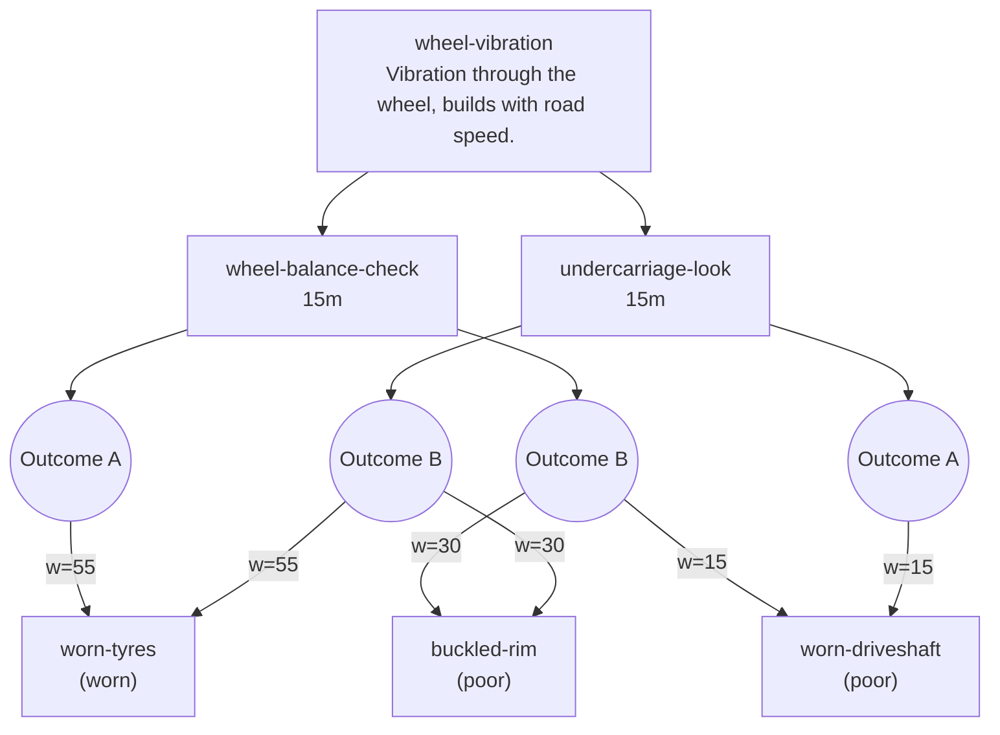
```mermaid
flowchart TD
  SYM_wheel_vibration["wheel-vibration<br/>Vibration through the wheel, builds with road speed."]
  T_wheel_balance_check["wheel-balance-check<br/>15m"]
  SYM_wheel_vibration --> T_wheel_balance_check
  T_wheel_balance_check --> T_wheel_balance_check_G0(("Outcome A"))
  FM_worn_tyres["worn-tyres<br/>(worn)"]
  T_wheel_balance_check_G0 -->|"w=55"| FM_worn_tyres
  T_wheel_balance_check --> T_wheel_balance_check_G1(("Outcome B"))
  FM_buckled_rim["buckled-rim<br/>(poor)"]
  T_wheel_balance_check_G1 -->|"w=30"| FM_buckled_rim
  FM_worn_driveshaft["worn-driveshaft<br/>(poor)"]
  T_wheel_balance_check_G1 -->|"w=15"| FM_worn_driveshaft
  T_undercarriage_look["undercarriage-look<br/>15m"]
  SYM_wheel_vibration --> T_undercarriage_look
  T_undercarriage_look --> T_undercarriage_look_G0(("Outcome A"))
  T_undercarriage_look_G0 -->|"w=15"| FM_worn_driveshaft
  T_undercarriage_look --> T_undercarriage_look_G1(("Outcome B"))
  T_undercarriage_look_G1 -->|"w=55"| FM_worn_tyres
  T_undercarriage_look_G1 -->|"w=30"| FM_buckled_rim
```

### diff-whine

Whines on the overrun. Quiet under power.

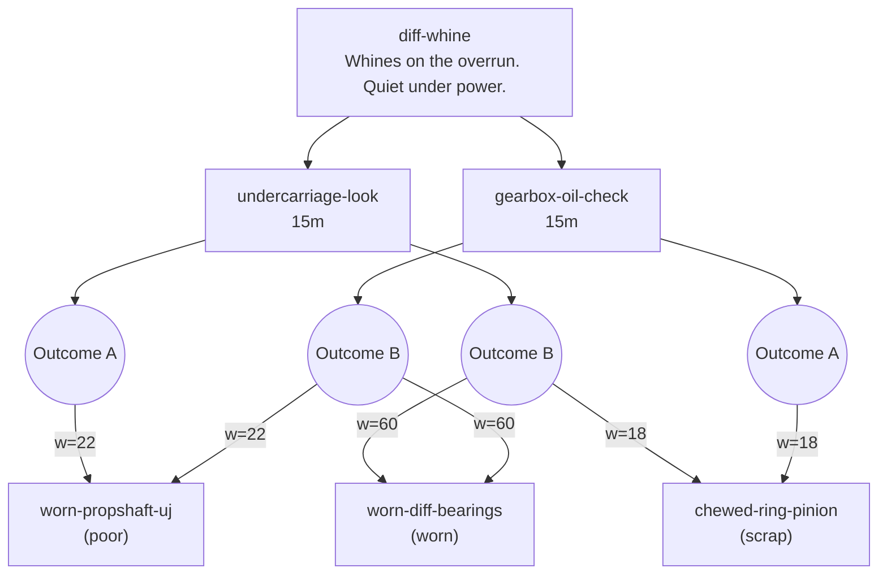
```mermaid
flowchart TD
  SYM_diff_whine["diff-whine<br/>Whines on the overrun. Quiet under power."]
  T_undercarriage_look["undercarriage-look<br/>15m"]
  SYM_diff_whine --> T_undercarriage_look
  T_undercarriage_look --> T_undercarriage_look_G0(("Outcome A"))
  FM_worn_propshaft_uj["worn-propshaft-uj<br/>(poor)"]
  T_undercarriage_look_G0 -->|"w=22"| FM_worn_propshaft_uj
  T_undercarriage_look --> T_undercarriage_look_G1(("Outcome B"))
  FM_worn_diff_bearings["worn-diff-bearings<br/>(worn)"]
  T_undercarriage_look_G1 -->|"w=60"| FM_worn_diff_bearings
  FM_chewed_ring_pinion["chewed-ring-pinion<br/>(scrap)"]
  T_undercarriage_look_G1 -->|"w=18"| FM_chewed_ring_pinion
  T_gearbox_oil_check["gearbox-oil-check<br/>15m"]
  SYM_diff_whine --> T_gearbox_oil_check
  T_gearbox_oil_check --> T_gearbox_oil_check_G0(("Outcome A"))
  T_gearbox_oil_check_G0 -->|"w=18"| FM_chewed_ring_pinion
  T_gearbox_oil_check --> T_gearbox_oil_check_G1(("Outcome B"))
  T_gearbox_oil_check_G1 -->|"w=60"| FM_worn_diff_bearings
  T_gearbox_oil_check_G1 -->|"w=22"| FM_worn_propshaft_uj
```

### sagging-spring

Sits lower than it should. Wallows over rough tarmac.

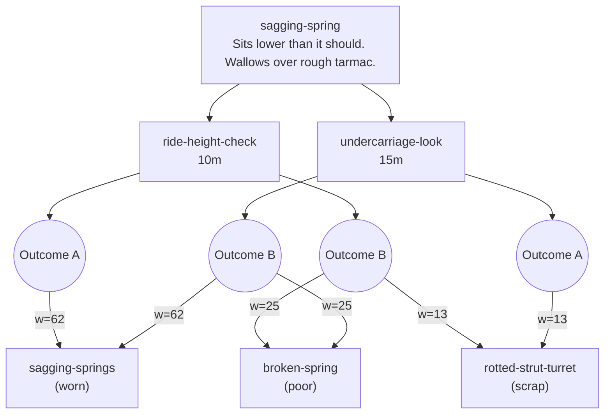
```mermaid
flowchart TD
  SYM_sagging_spring["sagging-spring<br/>Sits lower than it should. Wallows over rough tarmac."]
  T_ride_height_check["ride-height-check<br/>10m"]
  SYM_sagging_spring --> T_ride_height_check
  T_ride_height_check --> T_ride_height_check_G0(("Outcome A"))
  FM_sagging_springs["sagging-springs<br/>(worn)"]
  T_ride_height_check_G0 -->|"w=62"| FM_sagging_springs
  T_ride_height_check --> T_ride_height_check_G1(("Outcome B"))
  FM_broken_spring["broken-spring<br/>(poor)"]
  T_ride_height_check_G1 -->|"w=25"| FM_broken_spring
  FM_rotted_strut_turret["rotted-strut-turret<br/>(scrap)"]
  T_ride_height_check_G1 -->|"w=13"| FM_rotted_strut_turret
  T_undercarriage_look["undercarriage-look<br/>15m"]
  SYM_sagging_spring --> T_undercarriage_look
  T_undercarriage_look --> T_undercarriage_look_G0(("Outcome A"))
  T_undercarriage_look_G0 -->|"w=13"| FM_rotted_strut_turret
  T_undercarriage_look --> T_undercarriage_look_G1(("Outcome B"))
  T_undercarriage_look_G1 -->|"w=62"| FM_sagging_springs
  T_undercarriage_look_G1 -->|"w=25"| FM_broken_spring
```

### quarter-panel-filler

Faint filler line along a rear quarter panel.

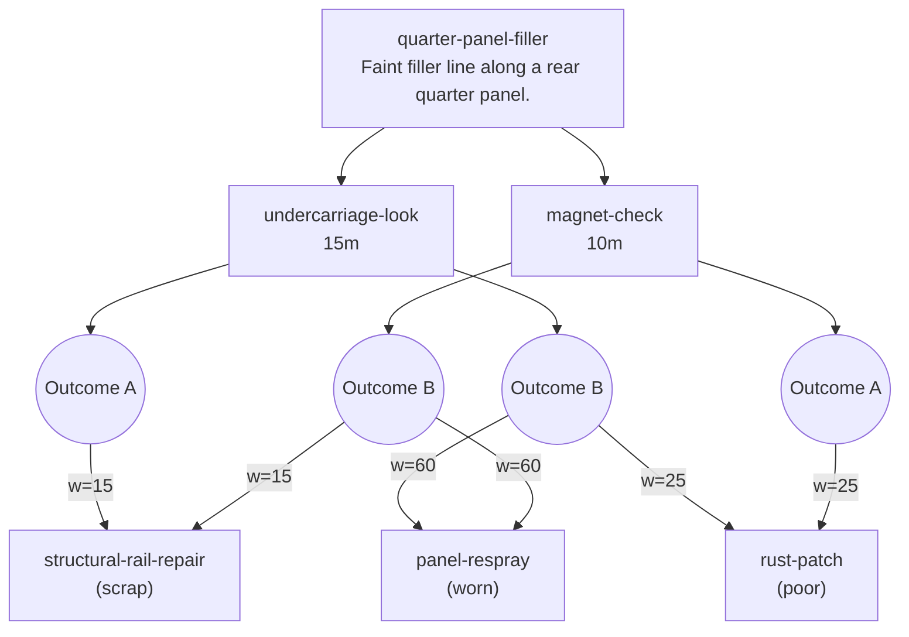
```mermaid
flowchart TD
  SYM_quarter_panel_filler["quarter-panel-filler<br/>Faint filler line along a rear quarter panel."]
  T_undercarriage_look["undercarriage-look<br/>15m"]
  SYM_quarter_panel_filler --> T_undercarriage_look
  T_undercarriage_look --> T_undercarriage_look_G0(("Outcome A"))
  FM_structural_rail_repair["structural-rail-repair<br/>(scrap)"]
  T_undercarriage_look_G0 -->|"w=15"| FM_structural_rail_repair
  T_undercarriage_look --> T_undercarriage_look_G1(("Outcome B"))
  FM_panel_respray["panel-respray<br/>(worn)"]
  T_undercarriage_look_G1 -->|"w=60"| FM_panel_respray
  FM_rust_patch["rust-patch<br/>(poor)"]
  T_undercarriage_look_G1 -->|"w=25"| FM_rust_patch
  T_magnet_check["magnet-check<br/>10m"]
  SYM_quarter_panel_filler --> T_magnet_check
  T_magnet_check --> T_magnet_check_G0(("Outcome A"))
  T_magnet_check_G0 -->|"w=25"| FM_rust_patch
  T_magnet_check --> T_magnet_check_G1(("Outcome B"))
  T_magnet_check_G1 -->|"w=60"| FM_panel_respray
  T_magnet_check_G1 -->|"w=15"| FM_structural_rail_repair
```

### damp-passenger-footwell

Carpet's damp on the passenger side.


```mermaid
flowchart TD
  SYM_damp_passenger_footwell["damp-passenger-footwell<br/>Carpet's damp on the passenger side."]
  T_trace_the_wet["trace-the-wet<br/>5m"]
  SYM_damp_passenger_footwell --> T_trace_the_wet
  T_trace_the_wet --> T_trace_the_wet_G0(("Outcome A"))
  FM_heater_matrix_weep["heater-matrix-weep<br/>(worn)"]
  T_trace_the_wet_G0 -->|"w=38"| FM_heater_matrix_weep
  FM_perished_grommet["perished-grommet<br/>(poor)"]
  T_trace_the_wet_G0 -->|"w=14"| FM_perished_grommet
  FM_split_sunroof_drain["split-sunroof-drain<br/>(poor)"]
  T_trace_the_wet_G0 -->|"w=10"| FM_split_sunroof_drain
  T_trace_the_wet --> T_trace_the_wet_G1(("Outcome B"))
  FM_blocked_scuttle_drain["blocked-scuttle-drain<br/>(worn)"]
  T_trace_the_wet_G1 -->|"w=20"| FM_blocked_scuttle_drain
  FM_rotten_bulkhead_seam["rotten-bulkhead-seam<br/>(scrap)"]
  T_trace_the_wet_G1 -->|"w=18"| FM_rotten_bulkhead_seam
  T_coolant_check["coolant-check<br/>10m<br/>unlocked by trace-the-wet"]
  T_trace_the_wet -.-> T_coolant_check
  T_coolant_check --> T_coolant_check_G0(("Outcome A"))
  T_coolant_check_G0 -->|"w=38"| FM_heater_matrix_weep
  T_coolant_check --> T_coolant_check_G1(("Outcome B"))
  T_coolant_check_G1 -->|"w=14"| FM_perished_grommet
  T_coolant_check_G1 -->|"w=20"| FM_blocked_scuttle_drain
  T_coolant_check_G1 -->|"w=10"| FM_split_sunroof_drain
  T_coolant_check_G1 -->|"w=18"| FM_rotten_bulkhead_seam
  T_scuttle_drain_poke["scuttle-drain-poke<br/>10m<br/>unlocked by trace-the-wet"]
  T_trace_the_wet -.-> T_scuttle_drain_poke
  T_scuttle_drain_poke --> T_scuttle_drain_poke_G0(("Outcome A"))
  T_scuttle_drain_poke_G0 -->|"w=20"| FM_blocked_scuttle_drain
  T_scuttle_drain_poke --> T_scuttle_drain_poke_G1(("Outcome B"))
  T_scuttle_drain_poke_G1 -->|"w=38"| FM_heater_matrix_weep
  T_scuttle_drain_poke_G1 -->|"w=14"| FM_perished_grommet
  T_scuttle_drain_poke_G1 -->|"w=10"| FM_split_sunroof_drain
  T_scuttle_drain_poke_G1 -->|"w=18"| FM_rotten_bulkhead_seam
  T_undercarriage_look["undercarriage-look<br/>15m<br/>unlocked by trace-the-wet"]
  T_trace_the_wet -.-> T_undercarriage_look
  T_undercarriage_look --> T_undercarriage_look_G0(("Outcome A"))
  T_undercarriage_look_G0 -->|"w=18"| FM_rotten_bulkhead_seam
  T_undercarriage_look --> T_undercarriage_look_G1(("Outcome B"))
  T_undercarriage_look_G1 -->|"w=38"| FM_heater_matrix_weep
  T_undercarriage_look_G1 -->|"w=14"| FM_perished_grommet
  T_undercarriage_look_G1 -->|"w=20"| FM_blocked_scuttle_drain
  T_undercarriage_look_G1 -->|"w=10"| FM_split_sunroof_drain
  T_carpet_lift["carpet-lift<br/>5m<br/>unlocked by trace-the-wet"]
  T_trace_the_wet -.-> T_carpet_lift
  T_carpet_lift --> T_carpet_lift_G0(("Outcome A"))
  T_carpet_lift_G0 -->|"w=38"| FM_heater_matrix_weep
  T_carpet_lift_G0 -->|"w=14"| FM_perished_grommet
  T_carpet_lift_G0 -->|"w=10"| FM_split_sunroof_drain
  T_carpet_lift --> T_carpet_lift_G1(("Outcome B"))
  T_carpet_lift_G1 -->|"w=20"| FM_blocked_scuttle_drain
  T_carpet_lift_G1 -->|"w=18"| FM_rotten_bulkhead_seam
  T_hose_the_roof["hose-the-roof<br/>10m<br/>unlocked by coolant-check group 1"]
  T_coolant_check_G1 -.-> T_hose_the_roof
  T_hose_the_roof --> T_hose_the_roof_G0(("Outcome A"))
  T_hose_the_roof_G0 -->|"w=10"| FM_split_sunroof_drain
  T_hose_the_roof --> T_hose_the_roof_G1(("Outcome B"))
  T_hose_the_roof_G1 -->|"w=38"| FM_heater_matrix_weep
  T_hose_the_roof_G1 -->|"w=14"| FM_perished_grommet
  T_hose_the_roof_G1 -->|"w=20"| FM_blocked_scuttle_drain
  T_hose_the_roof_G1 -->|"w=18"| FM_rotten_bulkhead_seam
```

### exhaust-rasp

Deep rasp under load, quiet at idle.

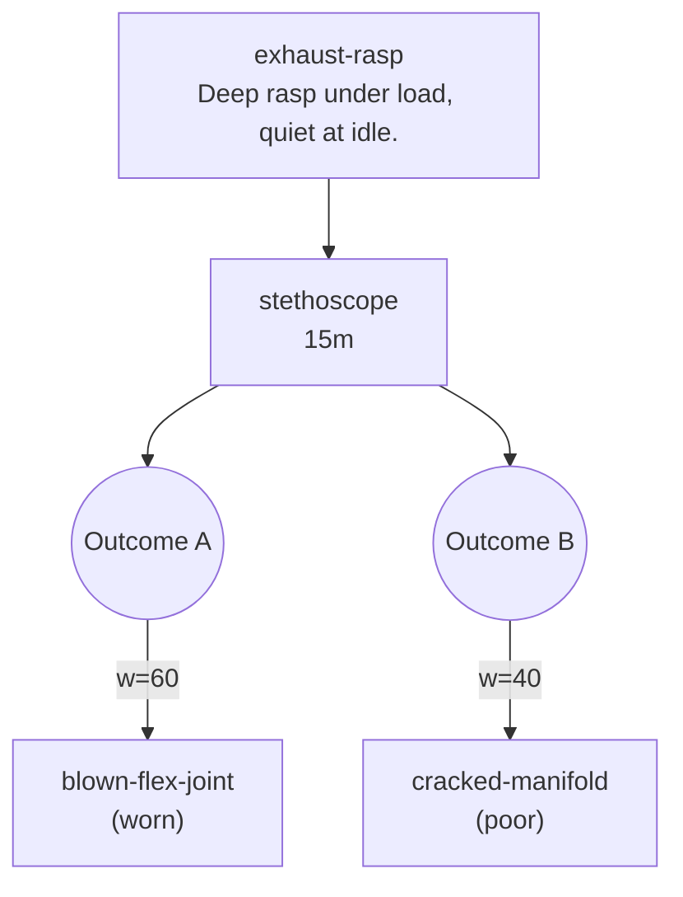
```mermaid
flowchart TD
  SYM_exhaust_rasp["exhaust-rasp<br/>Deep rasp under load, quiet at idle."]
  T_stethoscope["stethoscope<br/>15m"]
  SYM_exhaust_rasp --> T_stethoscope
  T_stethoscope --> T_stethoscope_G0(("Outcome A"))
  FM_blown_flex_joint["blown-flex-joint<br/>(worn)"]
  T_stethoscope_G0 -->|"w=60"| FM_blown_flex_joint
  T_stethoscope --> T_stethoscope_G1(("Outcome B"))
  FM_cracked_manifold["cracked-manifold<br/>(poor)"]
  T_stethoscope_G1 -->|"w=40"| FM_cracked_manifold
```

### oil-pressure-flutter

Oil light flickers at hot idle. Goes out with revs.

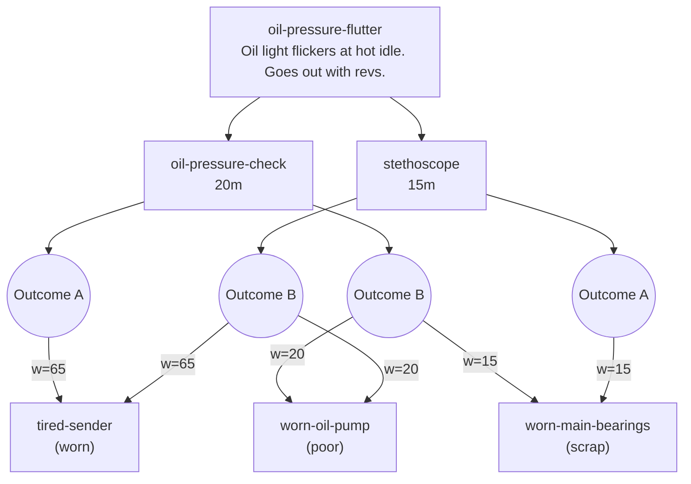
```mermaid
flowchart TD
  SYM_oil_pressure_flutter["oil-pressure-flutter<br/>Oil light flickers at hot idle. Goes out with revs."]
  T_oil_pressure_check["oil-pressure-check<br/>20m"]
  SYM_oil_pressure_flutter --> T_oil_pressure_check
  T_oil_pressure_check --> T_oil_pressure_check_G0(("Outcome A"))
  FM_tired_sender["tired-sender<br/>(worn)"]
  T_oil_pressure_check_G0 -->|"w=65"| FM_tired_sender
  T_oil_pressure_check --> T_oil_pressure_check_G1(("Outcome B"))
  FM_worn_oil_pump["worn-oil-pump<br/>(poor)"]
  T_oil_pressure_check_G1 -->|"w=20"| FM_worn_oil_pump
  FM_worn_main_bearings["worn-main-bearings<br/>(scrap)"]
  T_oil_pressure_check_G1 -->|"w=15"| FM_worn_main_bearings
  T_stethoscope["stethoscope<br/>15m"]
  SYM_oil_pressure_flutter --> T_stethoscope
  T_stethoscope --> T_stethoscope_G0(("Outcome A"))
  T_stethoscope_G0 -->|"w=15"| FM_worn_main_bearings
  T_stethoscope --> T_stethoscope_G1(("Outcome B"))
  T_stethoscope_G1 -->|"w=65"| FM_tired_sender
  T_stethoscope_G1 -->|"w=20"| FM_worn_oil_pump
```

### hesitates-under-load

Hesitates and flat-spots under hard acceleration. Smooth enough at a steady cruise.

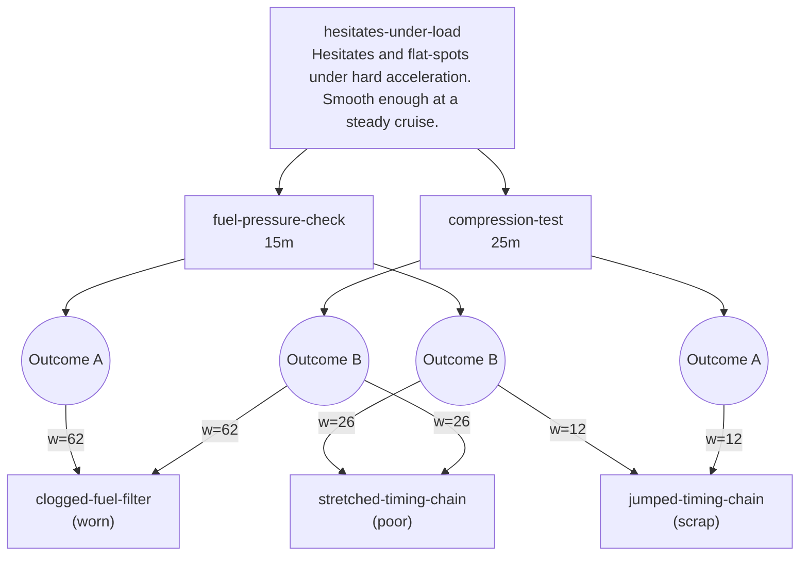
```mermaid
flowchart TD
  SYM_hesitates_under_load["hesitates-under-load<br/>Hesitates and flat-spots under hard acceleration. Smooth enough at a steady cruise."]
  T_fuel_pressure_check["fuel-pressure-check<br/>15m"]
  SYM_hesitates_under_load --> T_fuel_pressure_check
  T_fuel_pressure_check --> T_fuel_pressure_check_G0(("Outcome A"))
  FM_clogged_fuel_filter["clogged-fuel-filter<br/>(worn)"]
  T_fuel_pressure_check_G0 -->|"w=62"| FM_clogged_fuel_filter
  T_fuel_pressure_check --> T_fuel_pressure_check_G1(("Outcome B"))
  FM_stretched_timing_chain["stretched-timing-chain<br/>(poor)"]
  T_fuel_pressure_check_G1 -->|"w=26"| FM_stretched_timing_chain
  FM_jumped_timing_chain["jumped-timing-chain<br/>(scrap)"]
  T_fuel_pressure_check_G1 -->|"w=12"| FM_jumped_timing_chain
  T_compression_test["compression-test<br/>25m"]
  SYM_hesitates_under_load --> T_compression_test
  T_compression_test --> T_compression_test_G0(("Outcome A"))
  T_compression_test_G0 -->|"w=12"| FM_jumped_timing_chain
  T_compression_test --> T_compression_test_G1(("Outcome B"))
  T_compression_test_G1 -->|"w=62"| FM_clogged_fuel_filter
  T_compression_test_G1 -->|"w=26"| FM_stretched_timing_chain
```

### steering-wander

Steering feels vague, wants constant small corrections at speed.

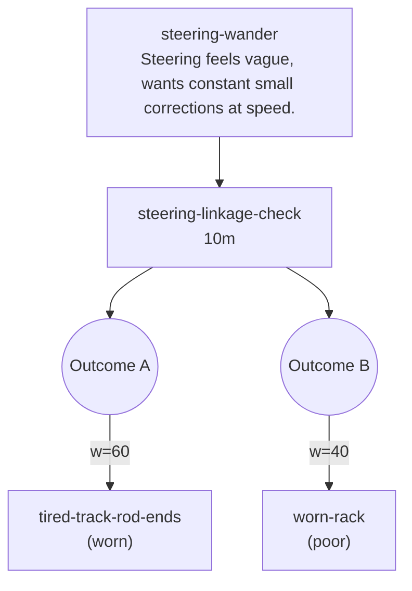
```mermaid
flowchart TD
  SYM_steering_wander["steering-wander<br/>Steering feels vague, wants constant small corrections at speed."]
  T_steering_linkage_check["steering-linkage-check<br/>10m"]
  SYM_steering_wander --> T_steering_linkage_check
  T_steering_linkage_check --> T_steering_linkage_check_G0(("Outcome A"))
  FM_tired_track_rod_ends["tired-track-rod-ends<br/>(worn)"]
  T_steering_linkage_check_G0 -->|"w=60"| FM_tired_track_rod_ends
  T_steering_linkage_check --> T_steering_linkage_check_G1(("Outcome B"))
  FM_worn_rack["worn-rack<br/>(poor)"]
  T_steering_linkage_check_G1 -->|"w=40"| FM_worn_rack
```
